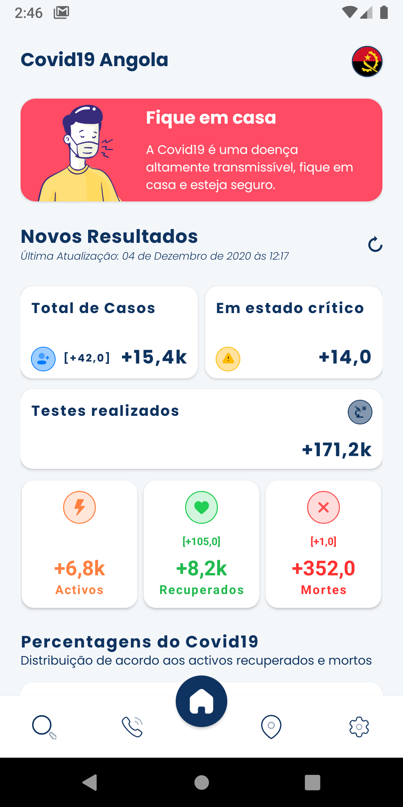
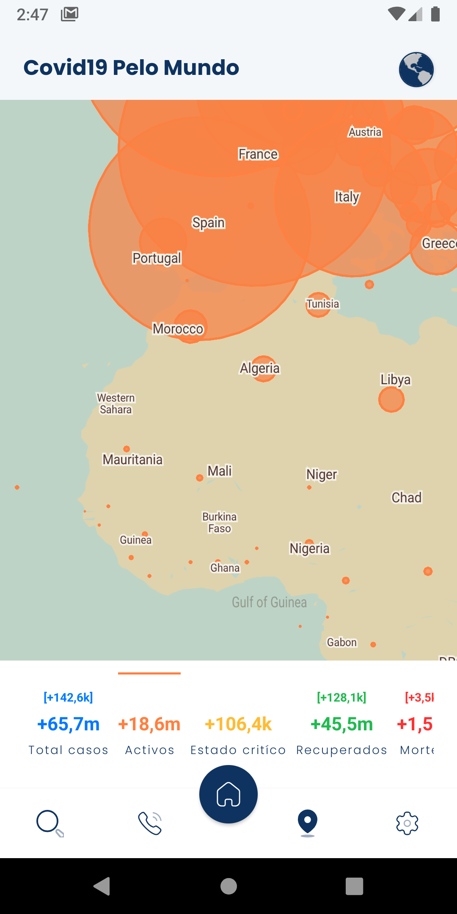
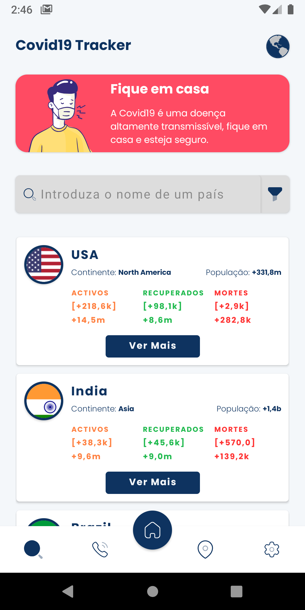
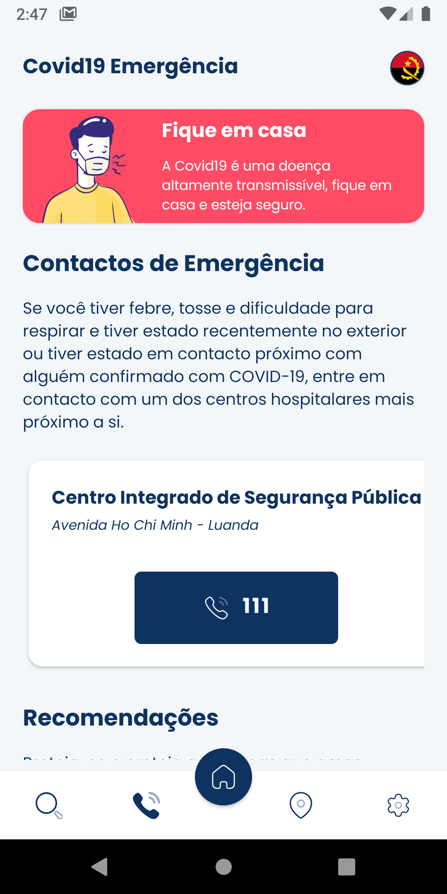
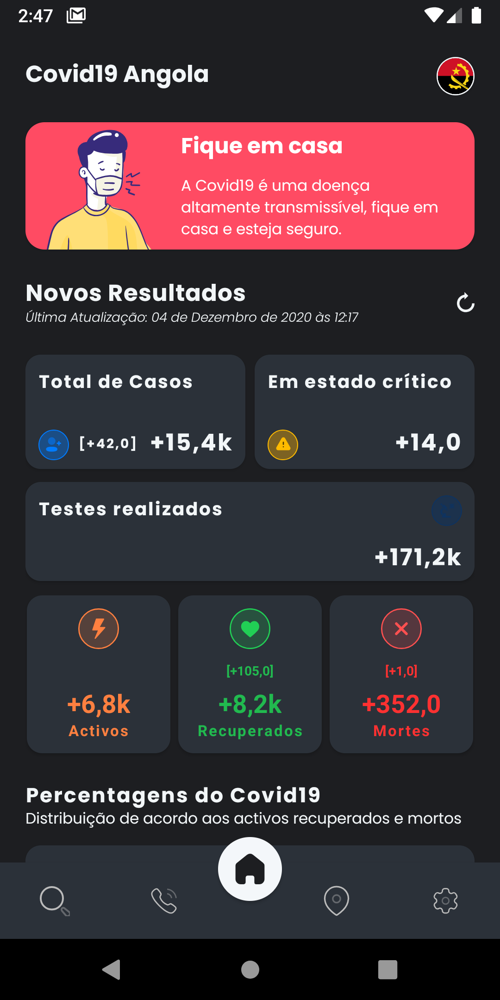
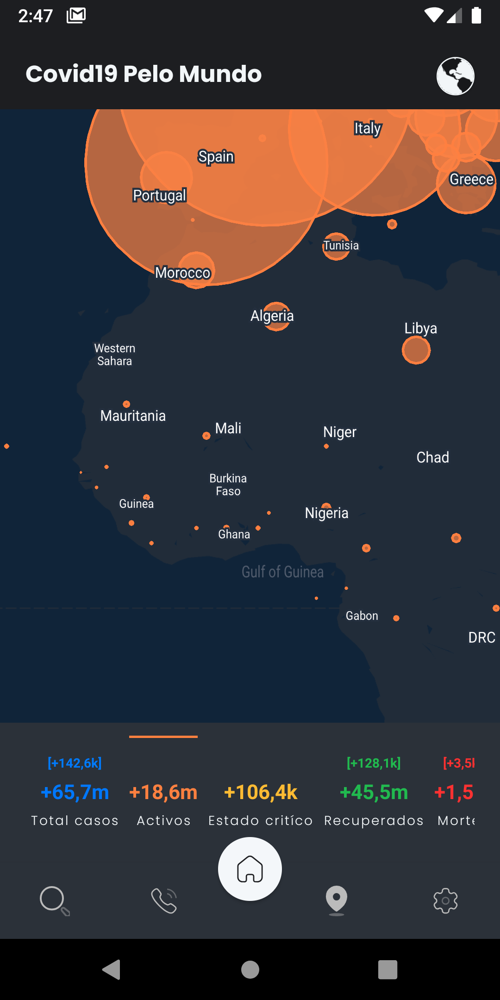
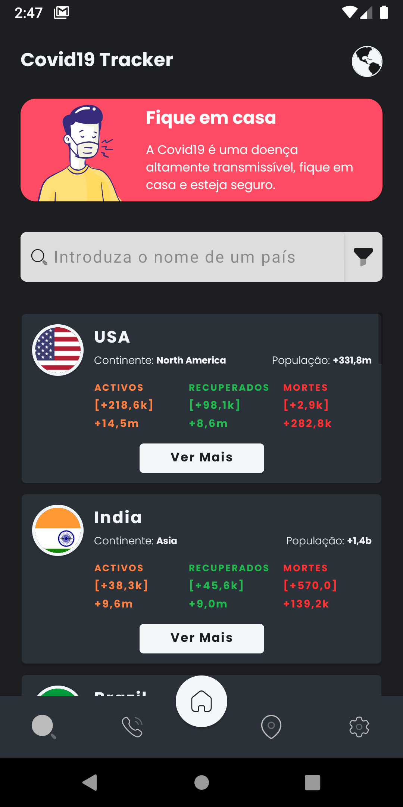
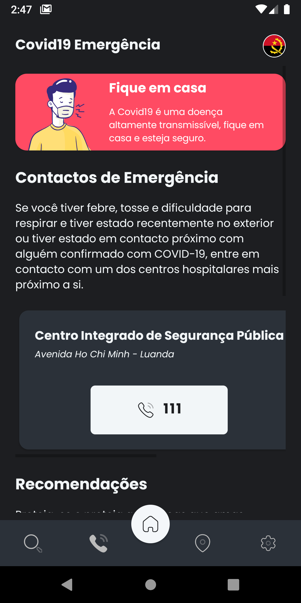

# Covid19 Tracker Angola 

App Mobile para as estatísticas do Covid-19 em Angola e ao redor do mundo, feito com `React Native`

    

 

## Telas do App

    
    
    
    
    
    
    
    

## Requisitos

Todos os requisitos aqui listados são indispensáveis para o desenvolvimento do projecto.

### Bibliotecas Instalados

#### Os pacotes podem ser instalados a partir do `npm` ou `yarn`

    "@react-native-community/async-storage": "^1.12.1",
    "@react-native-community/masked-view": "^0.1.10",
    "@react-navigation/bottom-tabs": "^5.11.2",
    "@react-navigation/native": "^5.8.10",
    "@react-navigation/stack": "^5.12.8",
    "moment": "^2.29.1",
    "numeral": "^2.0.6",
    "react": "16.13.1",
    "react-native": "0.63.4",
    "react-native-gesture-handler": "^1.9.0",
    "react-native-maps": "0.27.1",
    "react-native-reanimated": "^1.13.2",
    "react-native-safe-area-context": "^3.1.9",
    "react-native-screens": "^2.15.0",
    "react-native-svg": "^12.1.0",
    "react-native-svg-transformer": "^0.14.3",
    "styled-components": "^5.2.1",
    "victory-native": "^35.3.1"

### Android

#### Ferramentas necessárias para a construção:

* Node 8.3
* npm
* Java SE Development Kit 8
* Android Studio
* Android SDK

## Agradecimentos

Ao pessoal do [disease.sh](https://disease.sh/) por possuirem a melhor ``api`` free para rastreio do Covid-19, veja o projecto deles [aqui](https://github.com/disease-sh/api). Ao pessoal do [Piqodesign](https://dribbble.com/Piqodesign) por permitir utilizar os ``ícones`` para a `TabBar`. Ao pessoal da [drawkit.io](https://www.drawkit.io) permitir utilizar os Pack de ícones que podem ser encontrados [aqui](https://www.drawkit.io/product/covid-19).  

## Como contribuir

Para fazer um pull-request, primeiramente crie um fork do projeto para a sua conta, então clone o projeto em sua maquina:

`git clone https://github.com/moser-jose/covid19tracker.git`

Rodar o comando `npm Install`, para instalar todas as dependências.

Agora pronto, você já pode começar a contribuir com o projeto!

### Reportando Issues

Você pode criar uma issue [aqui](https://github.com/moser-jose/covid19tracker/issues), mas, lembre-se de ser claro e informar o máximo de detalhes possíveis.

### Submetendo Pull Requests

* Crie pull requests pequenos, para que a revisão seja feita mais facilmente
* Inclua detalhes do que está sendo feito na descrição
* Altera a documentação se for necessário

## Changelog

* 1.0.1 Criação do projeto. 📱

## Licença

Este projeto é regido pela licença [MIT](/LICENSE.md).
Lembre-se apenas de ser uma pessoa legal e enviar de volta eventuais modificações, correções ou melhorias. ✌️

## Autor

| [ @moser-jose](https://github.com/moser-jose) |
| :---: |